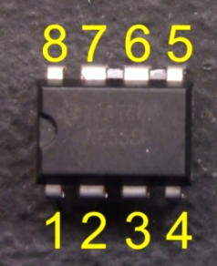
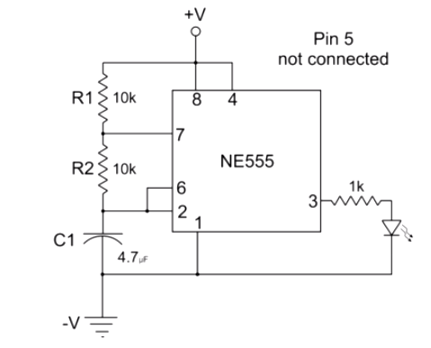
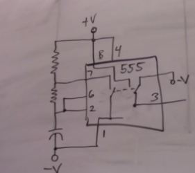
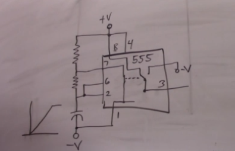
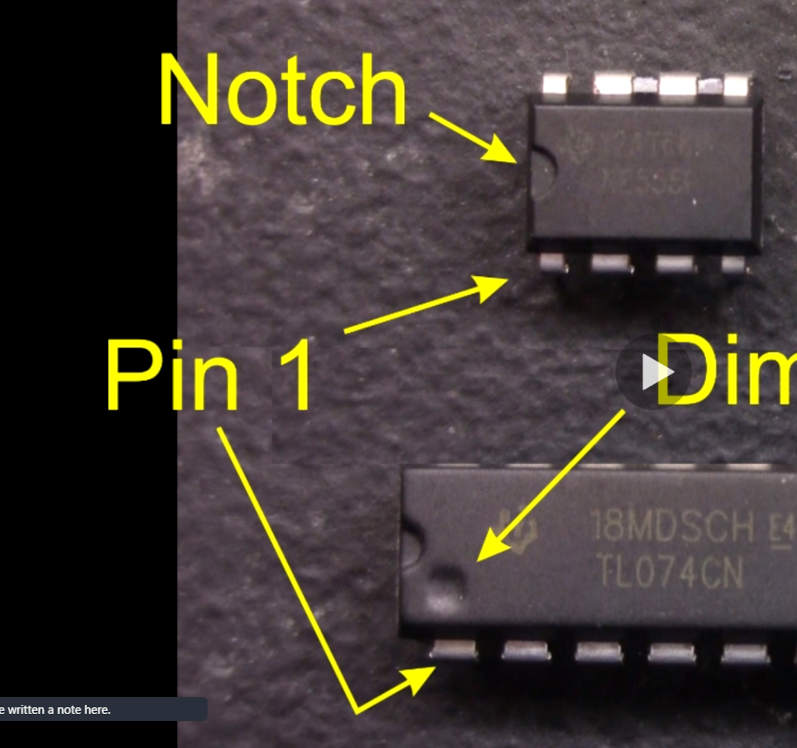
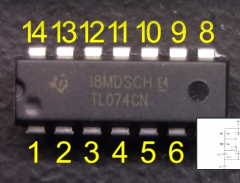

# 555 timer

Used to allow for bursts of current, givening a delay between current depending on the added resistance and capacitor on the timer.

## pins explained

Using the following circuit to explain how the 555 timer works:

A resistor of any size(larger the slower the pulse) goes between the positive power source and pin 7.

2nd resistor of any size(larger the slower the pulse) goes between pin 7 and pin 6.

Capacitor between pin 6 and the negative of the power source.

Connect pin 2 to pin 6. Pin 2 is used to measure the flow of electrons on pin 6 in order to switch on and off a part of a circuit.

Inside the 555 timer(see image below), its first state is when the capacitor is charging. Pin 2 reads a low current and tells the switch on 1 to open, where pin 3 is closed to the right.

Therefore the flow is going through the resistors to the capacitor. The larger the resisters the longer the cap takes to charge.

Once the cap reaches supply voltage pin 2 will signal the pins on 1 and 3 to switch (See image below).

now pin 7 is connected to pin 1 and pin 3 which is connected to the positive voltage. Causing the cap to discharge.

Once pin 2 detects a low current again, then it will switch it back to the first state allowing the cap to charge again.

All of this causes a pulse train out of pin 3.

## more

- Notched marked chip, the notch should be to the left the first bottom pin on the left is pin 1.
- Dimple marked chips, the dimple should be on the bottom left which will represent pin one as the first most left pin.
  For both then move counter clockwise around for each pin number.

