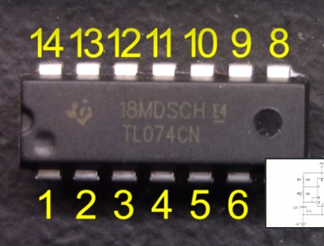

# Chips

- Notched marked chip, the notch should be to the left the first bottom pin on the left is pin 1.
- Dimple marked chips, the dimple should be on the bottom left which will represent pin one as the first most left pin.
  For both then move counter clockwise around for each pin number.

