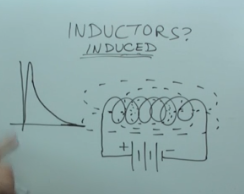
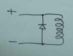

# Inductors

Induces a current from a magnetic field.

Use the right hand rule to determine the magnetic north from which way the coil is wrapped direction.

A inductor in a circuit will induce a current in its own circuit. Which will initially cause a high resistance and then drop off when trying to force the flow of the current in the opposite direction of the circuit.

If you switch the flow of the current the inductor will switch its magnetic poles. If you do it fast enough the resistance while cause a saw tooth shape diagram, esentially making a ac like current. This is called Reactance.

Inductors are measured in Henries

If a inductors magnetic field collapses Fly back voltage occurs within the coils which can damage the inductor. A diode can be used to prevent the Fly back voltage, by placing the diode accross the inductor in the opposite direction of current flow. The drop in magnetic fields causing the fly back voltage normally occurs when a circuits power source is removed. You must make sure the diode can handle the throw back voltage.

## Inductor ratings

Inductors are rated in current.  
An inductor wants as many wire wrapping to create a stronger field, this means the more wire the thinner the wire will be.

The thinner the wire the lower the current that can pass through it, hence the rating is current.
