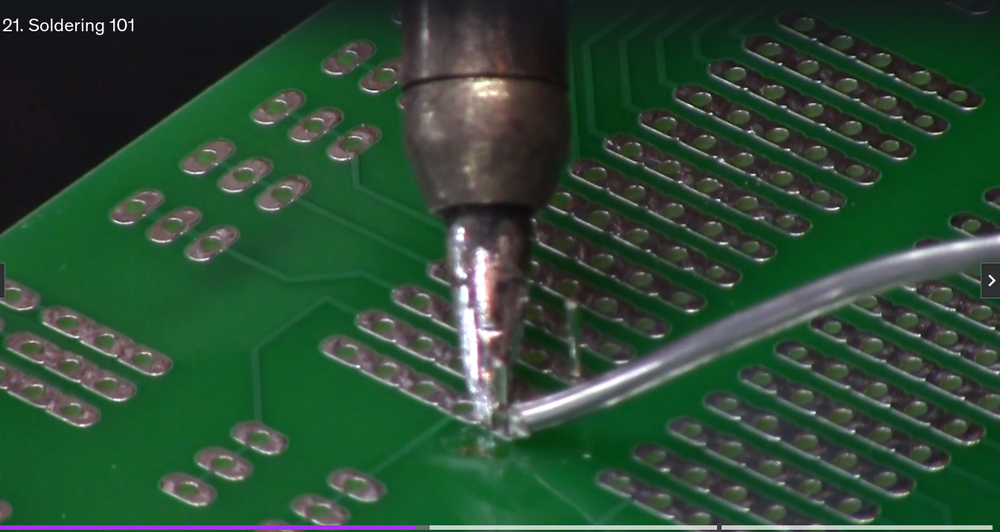
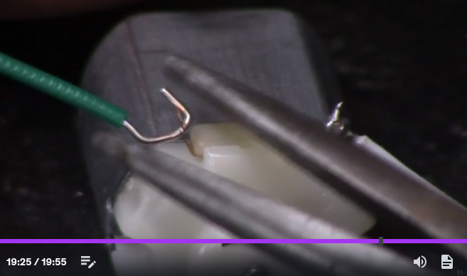

# Soldering

## Tining the soldering iron

Soldering irons needed to be tinned every now and then, especially new irons.

Simply heat the iron up and get a bunch of solder on it, let it sit for a couple of minutes to soak up the solder. Then wipe off the solder on your damp spunge.

## soldering on copper circuits

make sure to clean the copper, get the copper shiny(he uses a type of rouch spounge, almost iron wool).

Dirty copper will lead to cold solder joins, even if the copper gets hot enough.

## Cold solder joins

These occur when soldering is done at a temperature that is not hot enough to make a proper connection. This causes a joint of high resistance, even if the component is held in place.

To remove cold joins just reheat the join with the soldering iron and move around the solder, or use the solder sucker to remove the solder.

## Soldering technic

Make sure to pin the soldering iron to the solder pad of the pcb board and the componets pin, the put the solder against the pin and the soldering iron. This will create a pool of solder around the component.

Make sure not to solder desolder and resolder too many times as there is glue under the pcb solder pad and it can come out which can be fixed but it not pleasant.
Try get the heat times as short as possible to avoid this.

### Non-plastic component soldering

tin the components joints and tin the wire. Then place the wire and component together and place the iron to melt the component and wire solder together.

### Plastic or meltable components

If the component has a loop, wrap the wire around the loop into itself, use the pliers to press the wire onto itself:

Then solder the both the wire and the component plate together. He says not to spend too long on the soldering in order to not melt the plastic, but he does take longer to solder it than with non-plastic component soldering(few seconds longer)

## Removing solder

Using the solder sucker, heat the solder up with your iron, engage the solder sucker and press the solder sucker up to the solder and trigger the sucker.
