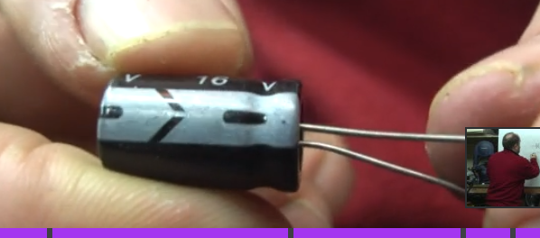

# Capacitors

Capacitors have a number system in order do gauge the units in pico farads.

Example 104

is 10 followed by 4 zeros.
100 000 pico farads or 100 nano farads or 0.1 micro farads

capacitors symbols can look like switches

-||-

but the easier more distinctive capacitor symbol:
-|(-

where the left straight line would be the positive lead and the curved line would be negative.

Here is a image indicating the negative lead of the capacitor

