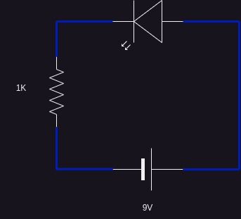
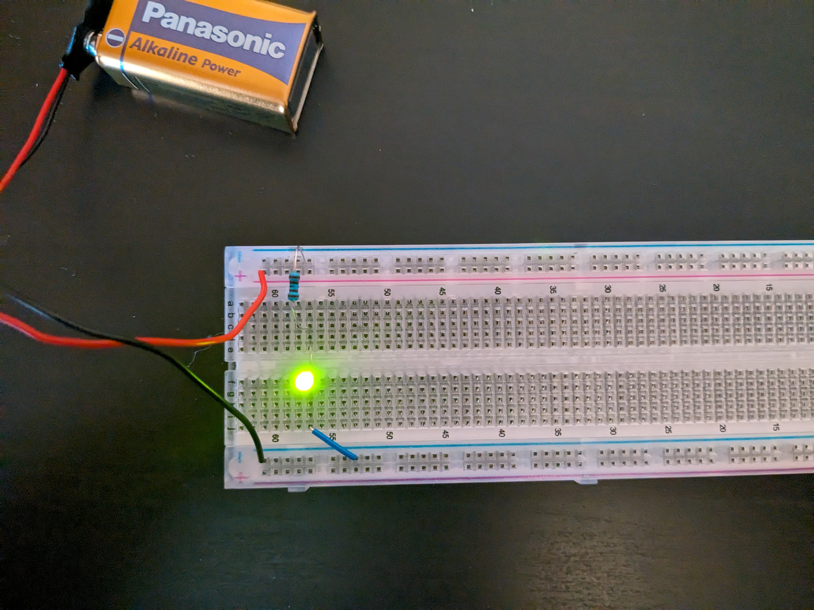

# LED circuit

A simple LED circuit

## Requires

breadboard, 9v connector, 1k resistor, 1LED(not rgb), 1 jumper lead.

## schematics

## Build Instructions

9v connector:

positive top rail(any hole)

negative bottom rail(any hole)

1k resistor:

can be connected any way around

connect to positive top rail(any hole inline with the positive lead)

connect the other end in any hole in the middle rail inline with the positive rail connection.

LED:

Find the negative lead, either flat side of the plastic or shorter lead.

Put the positive lead in any hole after the resistor's negative lead

Connect the negative lead in the same row as the positive lead there after

Jump lead:

Complete the circuit by adding on side of the lead in the same row after the LED's negative lead

Then connect the other side into the negative rail, which is in line with the 9v negative wire(any hole in that row will be fine)

## Observations

LED's voltages

Blue: 2.91 v
Yellow: 1.93
Red: 1.94 V
Green: 2 V
