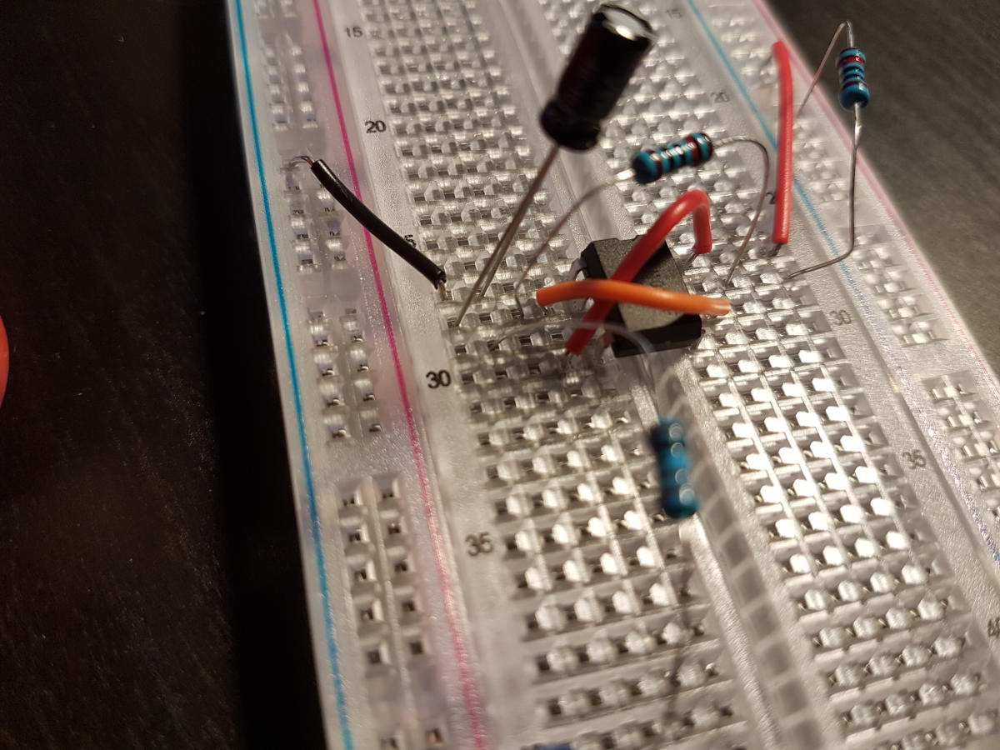

# Pulsating LED Circuit

## Requires

board, 555 timer, 4x jumper wires, 2 x 10k resistors, 1x 1k resistor(protect the LED), 1xLED(Not rgb), 1X 4.7 microF capacitor, 9v power clip

## schematics

[diagram to use the timer](../files/555+LED+flasher+schematic+download.pdf)

## Build Instructions

Face board possitive on top, neg bottom

Place the 555 timer with the notch on the left, where the top legs are in the "f" rail and bottom in the "e" rail

connect a jumper cable from the positive rail to the same column pin 8 is on

Then take another jumper cable can connect pin 4 to pin 8.

Connect pin 1 to negative with a jumper wire

Connect pin 2 to pin 6 with a jumper wire

Connect 1x10k resistor to the positve rail then to any column in line with pin 7

Connect 1x10k resistor closer to the 555 timer on column 7 than the last 10k resitor, connect the other end of the resistor to either pin 6 or pin 2 since they are both connect to one another.

Connect the 4.7 microF cap with negative on pin 1 and possitive on pin 2. My cap is place closer to the negative rail where all the other componets are closer to the chip(resistor and jumper cables)

Connect a 1k resistor on pin 3 (To protect the LED and the chip) and any where along the same row. I put it futher out so that the circuit is not crammed.

Connect negative lead of a LED into the negative power rail, put the positive lead in the same column as the 1k resistor.

Connect you battery clips positve to positive rail, negative to negative rail

## Observations

Dont forget the middle rails run verticle and the power rails run horizontal.
