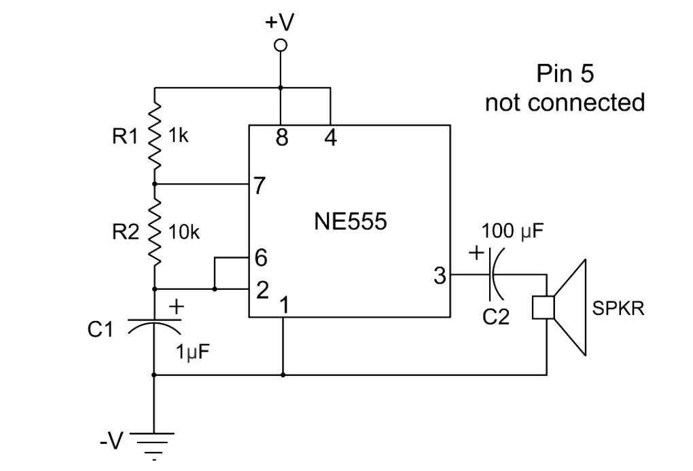

# 555 astable mode tone generator

Audio output generator, will generate a frequecy of 70 herz

## Requires

breadboard, 9v connector, 9v battery, 6x jumper wires, 1x speaker, 1x 1k resistor, 1x 100k resistor, 1x 555 timer, 1x 1 micro ferrit cap, 1x 100 micro ferrit cap

## schematics

## Build Instructions

Place the 555 timer with the notch facing left in the middle of the board. Where the upper pins are on row "f" and lower pins are on row "e". For ref pin1 is on col 32, pin 4 is on col 35.

place the positive jump wire from positive rail to row j col 32, same col as pin 8 of timer.
place the negative jump wire from negative rail to row a col 32, same col as pin 1 of timer.

Connect pin 8 and 4 with a jumper wire, so row g col 32 to row d col 35.
Connect pin 2 and 6 with a jumper wire, so row g col 34 to row d col 33.

Connect the 1k resistor to pin 7 and 8(note you can add the resistor to the positive rail), row i col 32 for pin 8, row i col 33 for pin 7.

Connect the 100k resistor to pin 7 and pin 2, row h col 33 for pin 7, row c column 33 for pin 2.

connect the 1 micro ferrit cap to pin 1(negative) and 2(positive). Negative on row b col 32 and postive row b col 33.

connect the 100 micro ferrit cap to pin 3(Positive Cap pin) to the positve wire(negative cap pin) speaker. positive cap pin in on row b col 34, Negative cap pin on row b col 37.

Connect the speaker. Positive row a col 37, in the same column as the 100 mirco ferrit cap.
Negative on the negative rail.

Connect the battery connector leads to the positive and negative rails.

Connect the 9v battery

## Observations

Intially I connected the 100k micro ferrit cap to pin 4 by mistake, the circuit worked and the speaker had a slight hum.

Then I reconnected the cap to pin 3, at first the speak sounded like a vibrating phone, but then completely stopped.

Now either way just makes a slight sound on connection then stops.

Maybe the cap is dead, or the circuit might be slightly wrong.
