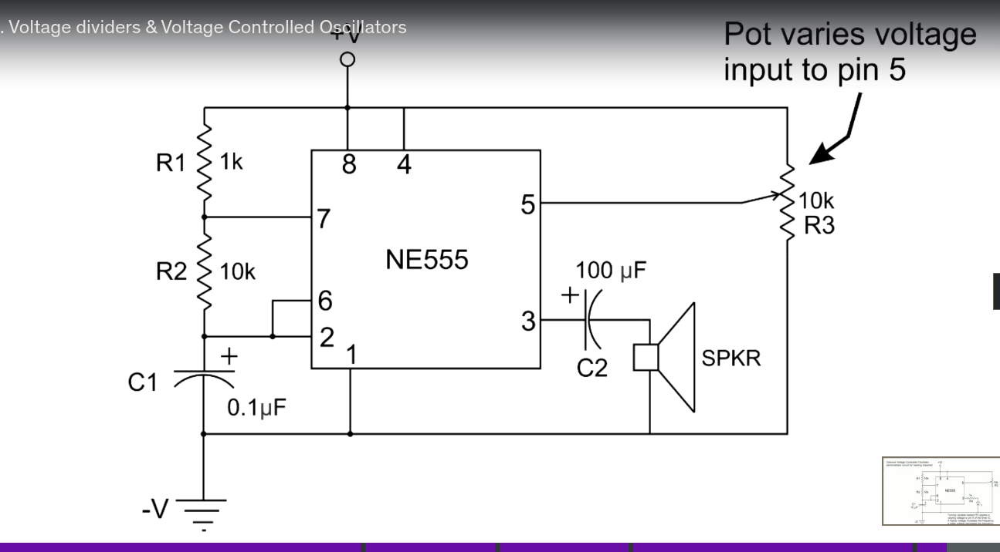

# 555 astable mode tone generator with pot

Audio output generator, will generate a frequecy of 70 herz

## Requires

breadboard, 9v connector, 9v battery, 6x jumper wires, 1x speaker, 1x 1k resistor, 1x 10k resistor, 1x 555 timer, 1x 0.1 micro ferrit cap(I dont have a 0.1 miro ferrit cap, using 1 micro ferrit cap), 1x 100 micro ferrit cap, 1x 10k potentiometer

## schematics

## Build Instructions

## Observations
