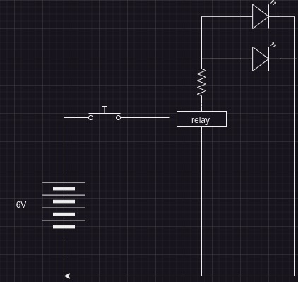

# LED relay circuit

## Requires

4x AA 1.5v batteries, battery enclosure to supply 6v, 2x jumper leads, a relay, a switch(example uses a momentary switch), a 1k resistor, 2x LED

## schematics

## Build Instructions

Place the switch any where on the board, this case top row of pins in h33 h34 h35, bottom row of pints in f33, f34, f35.

Place a jumper wire from the switch right position i34 to the positve rail

place a jumper wire from the switches common i33 out away from the switch h25

place the one side of the relay coil lead in the same column as the jumper lead f25. Place the other relay coil lead intp the negative rail.

Place the relay common lead ianywhere away f17. place a 1k resistor in the same row as the common relay lead g17, place the other end of the resistor onto the positive rail.

place the open lead of the relay away d27, in the same column place a led postive lead in a27 and negative lead on the negative rail.

Place the closed lead of the relay away c29, in the same column place a led positive lead in a29 and negative on the negative rail.

place the positive and negative leads of the 6 volt source onto the respective rails.

## Observations

## reference

Build reference: [switches and replays chapter](https://www.udemy.com/course/analog-electronics-robotics-learn-by-building/learn/lecture/4257990#overview)

at ~12min in he builds the circuit
