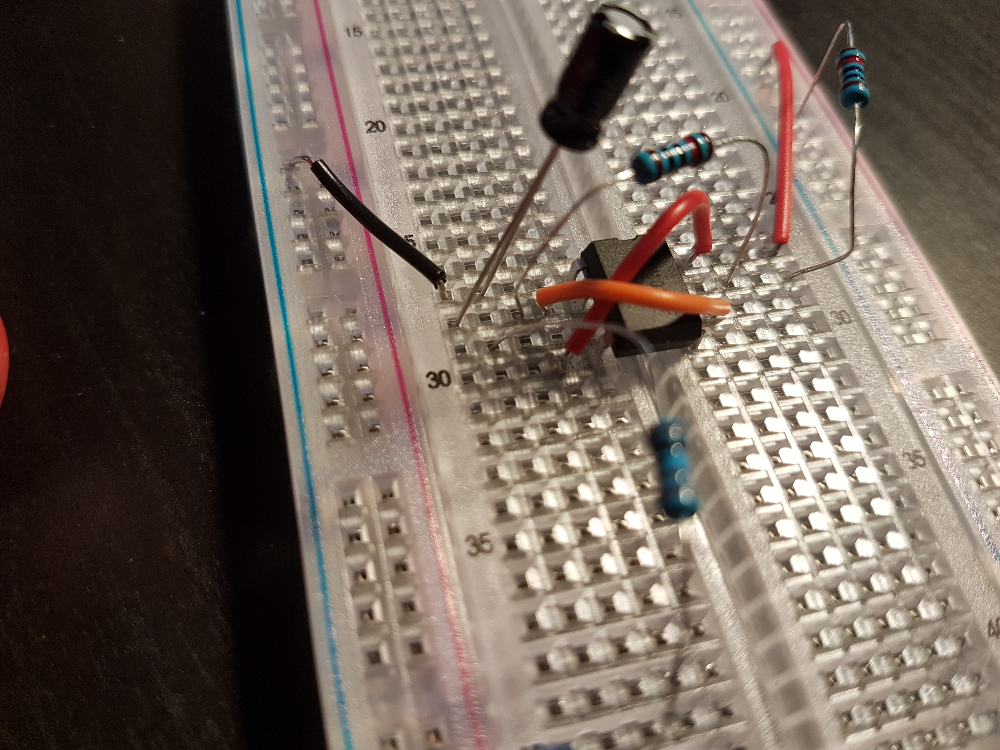

# Components information #

## led ##
Is a diode
Negative is marked with a flatted side next to the lead.

## chips ##

* Notched marked chip, the notch should be to the left the first bottom pin on the left is pin 1. 
* Dimple marked chips, the dimple should be on the bottom left which will represent pin one as the first most left pin. 
For both then move counter clockwise around for each pin number.

### 555 timer ###

Used to allow for bursts of current, givening a delay between current depending on the added resistance and capacitor on the timer.

* [diagram to use the timer](./files/555+LED+flasher+schematic+download.pdf)

