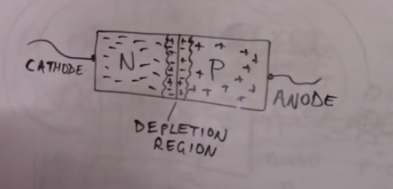

# diodes

Diodes are semi-conductors

The depletion zone is what allows a diode to flow in one direction.
This is a deadzone, a air gap.

If connected with positve on cathode and negative on the anode, the depletion zone increases in size making it difficult for electrons to jump across aka move.

But when connected with the negative on the cathode and positive on the anode, the depletion zone shrinks so that electrons can jump across it. This is called **forward bias**

You need a certain voltage to overcome that depletion zone. Silicon diodes is 0.7 volts, germainian diodes are 0.3 volts.

The top diode is a germaniam diode and silicon is the bottom diode. You can get them in different forms.

NB, the negative side is marked with a strip

Diodes limit the circiut to what ever its forward bias is, for silcon would be 0.7 volt.
The circuit will on ever be 0.7 volt no matter how much voltage you give the circuit.
It will burn out quickly if the voltage is too high and must be protected by a resister.

Diode schematic, note the electrocs flow in the opposite direction of the arrow.

Converting AC to DC with a bridge rectifier:

The voltages on the left of the diagram show AC alternating, when going through the diodes, one side always goes out the bridge rectifier as positive(right), the other negative(left). No matter what the alternative voltage is. The capacitor show a usual DC current wave.

LED(Light emitting Diode)
Telling which lead is negative can be difficult.
The plastic flattened on one side would indicate negative.
A shorter lead than the other also would indicate negative.

## LED

Is a diode
Negative is marked with a flatted side next to the lead.
