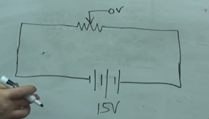
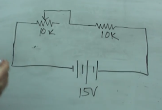

# potentiometers

They are variable resistors

The diagram below shows a potentiometer. If the potentiometer arrow moves all the way right there will be essentially complete voltage drop due to high resistance. If you move the arrow all the way left it will have no voltage drop.

Example of a potentiometer and a resistor

In the case of this example, the arrow is in the middle. So the resistance (lets call it R1) of the pot is 5k and R2 is 10K. So the voltage drop of R1 is (1/3) * 15v = 5v and the voltage drop of R2 is (2/3)*15v = 10v. The reason why I used 1/3 & 2/3 times the voltage is because:

If the resistors were exactly equal, the voltage drop would be split between the two so \* 1/2. In this case R1 was half the resistance of R2, therefore the ratio would be 1/3 for R1, 2/3 for R2.

Continuing with this example. If the arrow pointed right on the potentiometer, then R1 would be 10k and the voltage drop accross R1 & R2 would be 1/2 \* 15 = 7.5v

If the arrow was all the way left R1 would have no resistance, which would have no voltage drop on R1 but R2 would be a full voltage drop.

---

Pots are great for circuit design as they can help you find the perfect resistance in order to acheive the desired sound or light or what ever output.
