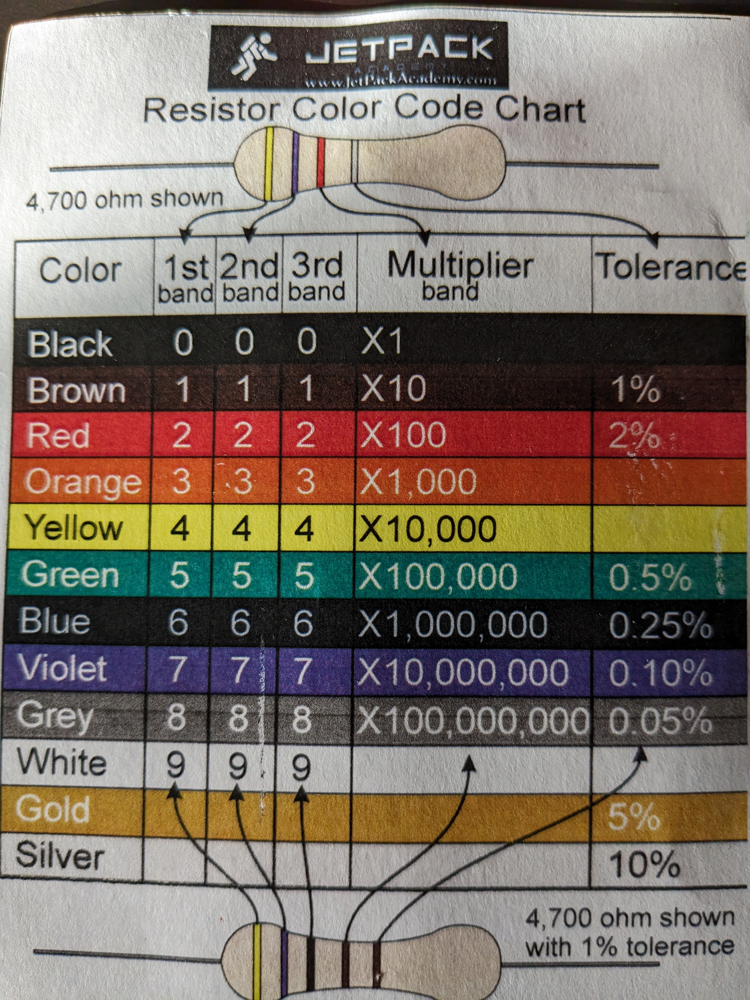

# How to read a resistors strips

## 3 - 4 band resistors

On the resistance colour chart
strip 1 & strip 2: you must take the number in the band column
strip 3 is a multiplier, here you multiple by the multiplier band column
strip 4 is the tolerance band, indicates how inaccurate the resistance calculation is. If there is no tolerance band, the tolerance will be 20%.



```
Example
strip 1 - brown
strip 2 - black
strip 3 - red
strip 4 - gold

look at the resistor colour code chart
brown 1
black 0
red x100

1 0 x 100 = 1000 ohms = 1 kilo ohm

-----------------------------------

Example
brown
black
orange

look at the resistor colour code chart
brown 1
black 0
orange x1000

1 0 x 1000 = 10 kilo ohms

-----------------------------------

example
yellow
purple
red

look at the resistor colour code chart
yellow 4
purple 7
red 100

4 7 x 100 = 4 700 = 4,7 kilo ohms

-----------------------------------

example
brown
black
green

look at the resistor colour code chart
brown 1
black 0
green x100 000

1 0 x 100 000 = 1 mega ohm

-----------------------------------

example
brown
black
black

look at the resistor colour code chart
brown 1
black 0
black x1

1 0 x1 = 10 ohm

-----------------------------------

example
brown
black
red
gold

look at the resistor colour code chart
brown 1
black 0
red x100
gold 5%

1 0 x100 5% = 1000 of 5% is 50 ohms = range 1050 - 950 ohms
```

## 5 band resistors

These are persision resistors.
Strip1, 2 & 3: you must take the number in the band column
Strip 4 is a multiplier, here you multiple by the multiplier band column
strip 5 is the tolerance band, indicates how inaccurate the resistance calculation is. The kit seems to only include brown tolerance resistors which have 1% tolerance.
If you are unsure which side the strips start from, use your multimeter to measure the resistance across the resistor.

```
example
Blue
Grey
Black
Orange
Brown

look at the resistor colour code chart
Blue 6
Grey 8
Black 0
Orange x1000
Brown 1%

680 x1000 = 0.68 mega ohm 1% tolerance

-----------------------------------

example
Blue 6
Grey 8
Black 0
Black x1
Brown 1%

0,68 kilo ohms

-----------------------------------

example
yellow 4
brown 1
black 0
brown 10
brown

4100
```
