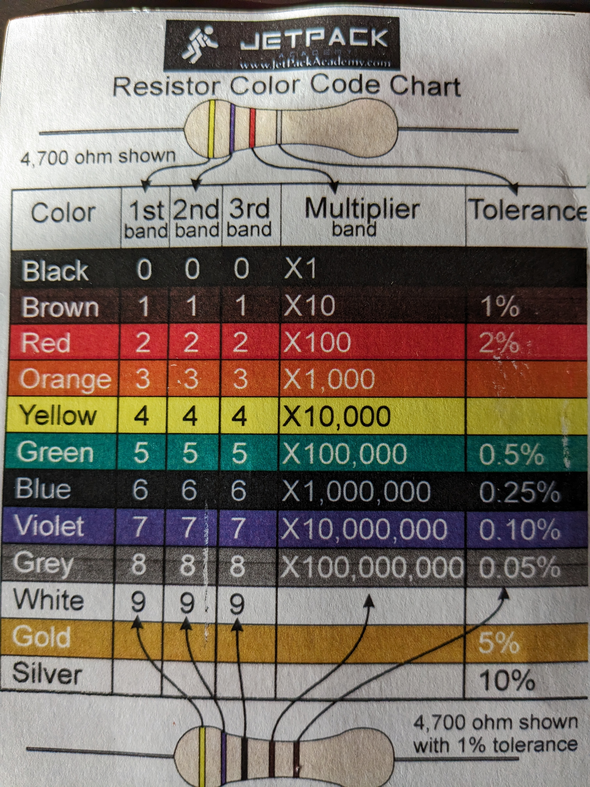

# Resistors and resistance

## Resistors Ratings

Resistors are rated in Watts.
This kits resistors are 1/4 watt resistors.
They directly convert the power they drop into heat.
Which can burn out your resistor.

say you have a 10 ohm resistor and a current of 0.2A.
The voltage drop will be 10*0.2 => 2V  
The power is W = VI => 2*0.2 => 0.4 Watts

Our resistors are ratted at 0.25Watts, so this current will burn out the resistor.

## Voltage dividers

Some components cannot cope with a voltage higher than a specific amount.
This is where voltage dividers come in, which are simply resistors to reduce the voltage in a circuit.

Example of reducing voltage accross a circuit


In this completed example above we started with a 10 volt circuit and with 3 resistors (10k 15k 2k)

The example was to work out the voltage drop across resistors.

Seeing that the current doesn't change through the entire circuit, ohms law is used to get the first voltage drop can be measured by each resistor and then simply added to represent the voltage drop accross all resistors.

So firstly get the amount of amps of the circuit:

I = V/R => 10 / 27 000 => 0.37 mA

Get voltage drops by each resistor  
R1 (voltage drop at R1) = 0.00037*10000 => 3.7v  
R2 = 0.00037*15000 => 5.5v  
R3 = 0.00037\*2000 => 0.74v

Making the total drop between R1 + R2 = 9.2V  
Making the total voltage drop = R1 + R2 + R3 = 9.94v

Example 2:

In this example we know what the battery voltage is and we know the maximum voltage the computer can handle.


Therefore R1 needs to drop 15 - x = 3.3v  
x = 15 - 3.3 => 11.7v

Then to make sure the voltage is used R2 should use the remaining voltage, therefore should be 3.3v

Now according to the lecturer you can put in high resitor here to work out the current.
He opted for 10k.

This makes the current I = 3.3/10000 => 0.33 mA

Now you can work out the resistance of R1.

R1 = 11.7/0.00033 => 35454 ohms

## How to read a resistors strips

### 3 - 4 band resistors

On the resistance colour chart
strip 1 & strip 2: you must take the number in the band column
strip 3 is a multiplier, here you multiple by the multiplier band column
strip 4 is the tolerance band, indicates how inaccurate the resistance calculation is. If there is no tolerance band, the tolerance will be 20%.



```
Example
strip 1 - brown
strip 2 - black
strip 3 - red
strip 4 - gold

look at the resistor colour code chart
brown 1
black 0
red x100

1 0 x 100 = 1000 ohms = 1 kilo ohm

-----------------------------------

Example
brown
black
orange

look at the resistor colour code chart
brown 1
black 0
orange x1000

1 0 x 1000 = 10 kilo ohms

-----------------------------------

example
yellow
purple
red

look at the resistor colour code chart
yellow 4
purple 7
red 100

4 7 x 100 = 4 700 = 4,7 kilo ohms

-----------------------------------

example
brown
black
green

look at the resistor colour code chart
brown 1
black 0
green x100 000

1 0 x 100 000 = 1 mega ohm

-----------------------------------

example
brown
black
black

look at the resistor colour code chart
brown 1
black 0
black x1

1 0 x1 = 10 ohm

-----------------------------------

example
brown
black
red
gold

look at the resistor colour code chart
brown 1
black 0
red x100
gold 5%

1 0 x100 5% = 1000 of 5% is 50 ohms = range 1050 - 950 ohms
```

### 5 band resistors

These are persision resistors.
Strip1, 2 & 3: you must take the number in the band column
Strip 4 is a multiplier, here you multiple by the multiplier band column
strip 5 is the tolerance band, indicates how inaccurate the resistance calculation is. The kit seems to only include brown tolerance resistors which have 1% tolerance.
If you are unsure which side the strips start from, use your multimeter to measure the resistance across the resistor.

```
example
Blue
Grey
Black
Orange
Brown

look at the resistor colour code chart
Blue 6
Grey 8
Black 0
Orange x1000
Brown 1%

680 x1000 = 0.68 mega ohm 1% tolerance

-----------------------------------

example
Blue 6
Grey 8
Black 0
Black x1
Brown 1%

0,68 kilo ohms

-----------------------------------

example
yellow 4
brown 1
black 0
brown 10
brown

4100
```
