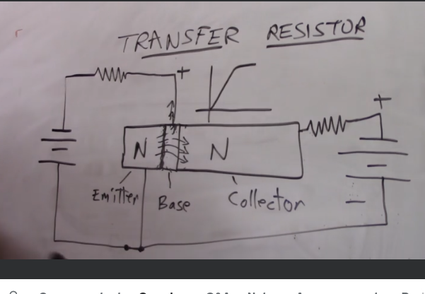

# Transistors

It is a resistor that changes resistance depending on the amount of current. At low current there will be high resistance, at high current there will be low resistance aka saturated.

Transistors can get very hot very quickly.

The diagram show a NPN resistor, and the graph show the current increase over time as resistance lessens:

Two ways to use a transistor:

- switching: where the transistor is off or saturated. When switching it is important to get to a point of no resistance to avoid heat transfer from the resistors.
- amplifying
