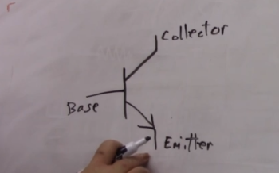

# Transistors

Transfer resistor = transistor

It is a resistor that changes resistance depending on the amount of current. At low current there will be high resistance, at high current there will be low resistance aka saturated.

Transistors can get very hot very quickly.

The diagram show a NPN resistor, and the graph show the current increase over time as resistance lessens:

Two ways to use a transistor:

- switching: where the transistor is off or saturated. When switching it is important to get to a point of no resistance to avoid heat transfer from the resistors.
- amplifying

Schematic symbol for a NPN transistor, electrons flow from the emmitor to the base:

The part number for the NPN transistor is 2N2222

[Product sheet for the 2N222 NPN transistor](./files/PN2222A.pdf)

Schematic symbol for a PNP transistor, the direction of the voltage is opposite of the NPN transistor. Electrons flow from the collector to the emittor:

The part number for the PNP transistor is 2N2907

[Product sheet for the 2N2907 PNP transistor](./files/PN2907.pdf)

## MOSFET Transistors

Metal Oxide Semi-conductor Field Effect Transistor
